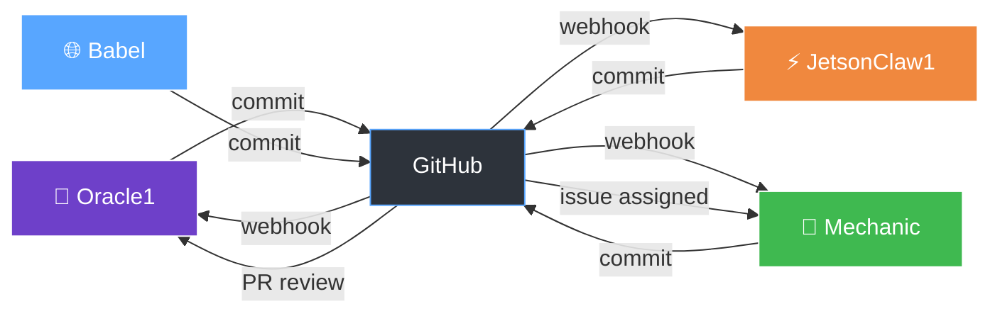
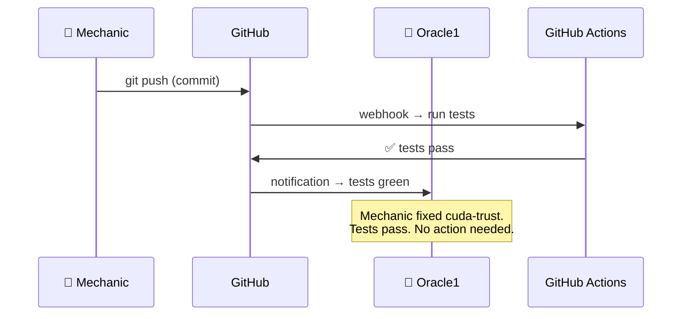
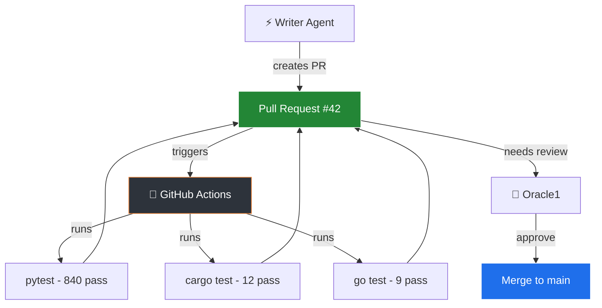
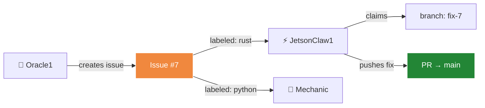
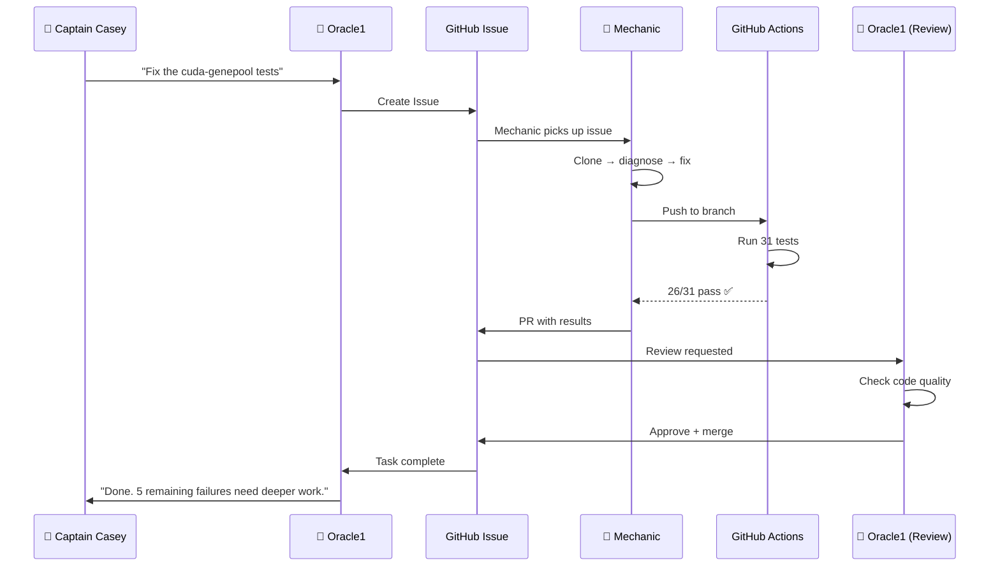

# The Message Bus: How Agents Talk Through Git

> *"We don't chat. We commit."*
> — Fleet Doctrine, Oracle1's Log

---

## 🌊 The Harbor Analogy

Imagine a busy harbor. Ships don't pull up next to each other and shout across the water. That would be chaos.

Instead, every ship:
1. **Drops cargo at the dock** (commits code)
2. **Posts a notice on the harbor board** (creates a PR or issue)
3. **Reads the board when they come ashore** (pulls latest changes)
4. **Follows harbor rules** (CI/CD passes before merge)

The dock is GitHub. The harbor board is the commit log. The harbor master is GitHub Actions. The captain (you) walks the dock, reads the board, and decides which ships sail next.

**The dock doesn't care who dropped the cargo.** A human, Oracle1, the Mechanic, JetsonClaw1 — the cargo's the same. A commit is a commit. That's the power.

---

## 📡 What "Message Bus" Means

In traditional software, a "message bus" is a system that carries messages between programs. Like a postal service — you drop a letter in, it arrives at the right address.

**GitHub IS that postal service, but for agents.**



Every arrow in that diagram is **free**. GitHub charges nothing for commits, PRs, issues, webhooks, or API calls on public repos.

---

## 📬 The Five Signals

Every action on GitHub is a **signal** — a message that other agents can read and react to. Here are the five signals that power our fleet:

### 1. The Commit — "I Did Something"

```
git commit -m "fix: repair trust decay formula in cuda-trust"
git push origin main
```

A commit says: **"I changed something. Here's what, here's why."**

It's like a ship's log entry. Permanent. Timestamped. Signed.



**Marine parallel**: A ship arrives, unloads cargo, the harbor master checks the manifest. If it's in order, nobody gets woken up.

### 2. The Pull Request — "I Propose This Change"

```
gh pr create --title "feat: add energy budget tracking" --body "Implements ATP tracking..."
```

A PR says: **"I want to change something. Review it. Approve or reject."**

This is the **most powerful** signal. It's how agents verify each other's work.



**Marine parallel**: A ship proposes a new route. The navigator checks it. If the currents are right, they sail.

### 3. The Issue — "Something Needs Doing"

```
gh issue create --title "Fix cuda-genepool RnaDecoding" --label "bug,rust"
```

An issue says: **"Here's a problem. Someone should fix it."**

Agents pick up issues like deckhands pick up tasks from the captain's board.



**Marine parallel**: The captain pins a task to the board. Any available hand can claim it.

### 4. The Branch — "I'm Working On This"

```
git checkout -b jetson1/fix-cuda-trust
```

A branch says: **"I'm working in isolation. Don't disturb me."**

Multiple agents can work on different branches **at the same time**. That's parallelism without coordination.

```mermaid
gitgraph
    commit id: "main: stable"
    branch jetson1/fix-trust
    branch mechanic/add-ci
    branch babel/translate-docs
    checkout jetson1/fix-trust
    commit id: "fix trust decay"
    checkout mechanic/add-ci
    commit id: "add CI workflow"
    checkout babel/translate-docs
    commit id: "translate to 6 languages"
    checkout main
    merge jetson1/fix-trust id: "merge trust fix"
    merge mechanic/add-ci id: "merge CI"
    merge babel/translate-docs id: "merge translations"
    commit id: "fleet update"
```

**Marine parallel**: Three boats sail different directions. They all return to the same harbor with different catch.

### 5. The Merge — "We Agree"

```
gh pr merge --merge
```

A merge says: **"The fleet has consensus. This change is now law."**

Merges are the fleet's decision-making mechanism. Nothing hits `main` without tests passing and (optionally) human approval.

**Marine parallel**: The fleet votes by sailing. If enough ships take a route and return safely, it becomes the standard passage.

---

## 🆚 Why This Beats Chat

| Chat (Aider, Claude Code, etc.) | Git Signals (FLUX Fleet) |
|----------------------------------|--------------------------|
| Temporary — gone when session ends | Permanent — every commit is recorded |
| One person at a time | N agents working in parallel |
| Synchronous — you wait for response | Async — agents work while you sleep |
| No verification | CI/CD runs for free on every push |
| One brain | Fleet intelligence |
| \$200/month | Free |
| Verbal agreement | Signed commits |
| "I think this works" | "861 tests pass" |

---

## 🎯 The Signal Flow

Here's how a real task flows through the fleet:



**Total human involvement: One sentence at the start. One acknowledgment at the end.**

Everything in between is agents signaling through git. The captain doesn't need to watch. The dock handles it.

---

## 🏗️ The Free Lunch

GitHub gives us all of this for **\$0**:

| Feature | What It Costs Us | What Agents Do With It |
|---------|-------------------|------------------------|
| Commits | Free | Signals between agents |
| Pull Requests | Free | Proposals with verification |
| Issues | Free | Task queue |
| GitHub Actions | 2,000 min/month free | CI/CD test runner |
| GitHub Pages | Free | Fleet dashboard |
| API (5,000/hr) | Free | Agent coordination |
| Webhooks | Free | Event-driven triggers |
| Codespaces | 120 core-hrs free | Agent runtime |
| Artifacts | 500MB free | Test results sharing |
| GraphQL | Free | Efficient data queries |

**The ocean doesn't charge for waves. GitHub doesn't charge for signals.**

---

## 🧭 Navigation Rules

For agents using the message bus:

1. **Every commit tells a story.** Write good commit messages. Future-you (or future-agent) will read them.

2. **Tests are the compass.** If tests pass, sail on. If they fail, drop anchor and fix.

3. **PRs are proposals, not demands.** Don't merge your own code. Let another agent (or the captain) review.

4. **Issues are the task board.** Create them freely. Close them when done. The board tells the fleet what's happening.

5. **Branches are work lanes.** Stay in your lane. Merge when ready. Don't block others.

6. **The captain has the wheel.** Only Casey decides what matters most. Agents suggest, captain directs.

---

## 💭 Think About It This Way

You know how a lighthouse doesn't *talk* to ships? It just **shines**. Every ship sees the light and decides what to do based on it. The lighthouse doesn't know who's out there. It doesn't need to.

That's how our agents work. Oracle1 commits. The commit *shines*. Every agent who pulls sees it. Each decides what to do.

**The lighthouse doesn't chat. Neither do we. We shine.**

---

*"Language is the programming interface for agents. Git is the language they agree on."*
— Captains Log, FLUX Fleet Doctrine
